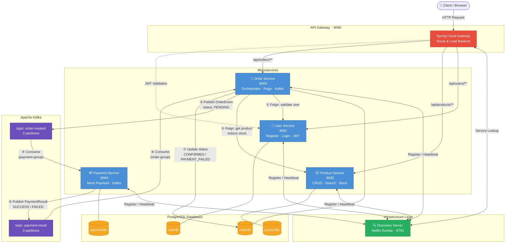

# 🛒 NimbusCart - Cloud-Native E-Commerce Microservices

A production-ready e-commerce platform built with **Spring Boot**, **Spring Cloud**, **Apache Kafka**, **Docker**, and **Kubernetes**.

## 🏗️ Architecture

```
User → API Gateway (8080) → Microservices → PostgreSQL / Kafka
```

| Service | Port | Description |
|---------|------|-------------|
| Discovery Server | 8761 | Netflix Eureka - Service Registry |
| API Gateway | 8080 | Spring Cloud Gateway - Single entry point |
| User Service | 8081 | Auth (JWT), Registration, User management |
| Product Service | 8082 | CRUD products, search, stock management |
| Order Service | 8083 | Order lifecycle, Feign calls, Kafka producer |
| Payment Service | 8084 | Mock payments, Kafka consumer/producer |

## 🗺️ Workflow Diagram



## 🔁 Event Flow

```
1. User places order → API Gateway → Order Service
2. Order Service validates user (Feign → User Service)
3. Order Service checks stock (Feign → Product Service)
4. Order created (PENDING) → Kafka topic "order-created"
5. Payment Service consumes → processes payment
6. Payment result → Kafka topic "payment-result"
7. Order Service consumes → updates status to CONFIRMED/FAILED
```

## 🚀 Quick Start

### Prerequisites
- Java 17+
- Docker & Docker Compose
- Maven

### Run everything with Docker Compose:
```bash
docker-compose up --build
```

### Or run locally (start in order):
```bash
# 1. Start PostgreSQL & Kafka (via Docker)
docker-compose up postgres zookeeper kafka

# 2. Start Discovery Server
cd discovery-server && mvn spring-boot:run

# 3. Start API Gateway
cd api-gateway && mvn spring-boot:run

# 4. Start services (each in a separate terminal)
cd user-service && mvn spring-boot:run
cd product-service && mvn spring-boot:run
cd order-service && mvn spring-boot:run
cd payment-service && mvn spring-boot:run
```

## 📡 API Examples

### Register
```bash
curl -X POST http://localhost:8080/api/users/register \
  -H "Content-Type: application/json" \
  -d '{"name":"John","email":"john@test.com","password":"pass123"}'
```

### Login
```bash
curl -X POST http://localhost:8080/api/users/login \
  -H "Content-Type: application/json" \
  -d '{"email":"john@test.com","password":"pass123"}'
```

### Create Product
```bash
curl -X POST http://localhost:8080/api/products \
  -H "Content-Type: application/json" \
  -d '{"name":"Laptop","description":"Gaming Laptop","price":999.99,"stockQuantity":50,"category":"Electronics"}'
```

### Place Order
```bash
curl -X POST http://localhost:8080/api/orders \
  -H "Content-Type: application/json" \
  -d '{"userId":1,"productId":1,"quantity":2}'
```

## 🐳 Kubernetes Deployment
```bash
kubectl apply -f k8s/deployment.yml
```

## �� Project Structure
```
NimbusCart/
├── api-gateway/          # Spring Cloud Gateway
├── discovery-server/     # Netflix Eureka
├── user-service/         # User + JWT Auth
├── product-service/      # Product catalog
├── order-service/        # Order management + Kafka
├── payment-service/      # Mock payments + Kafka
├── k8s/                  # Kubernetes manifests
├── docker-compose.yml    # One-command local setup
└── init-db.sql           # Database initialization
```

## 🛠️ Tech Stack
- **Backend:** Spring Boot 3.2, Spring Cloud 2023.0
- **Gateway:** Spring Cloud Gateway
- **Discovery:** Netflix Eureka
- **Communication:** OpenFeign (sync) + Apache Kafka (async)
- **Security:** JWT (jjwt 0.12)
- **Database:** PostgreSQL 16
- **Containers:** Docker, Kubernetes
